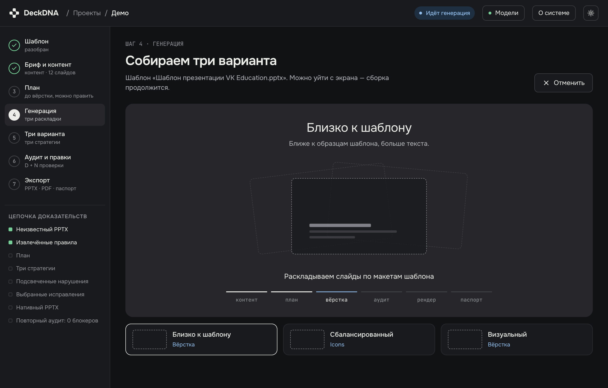
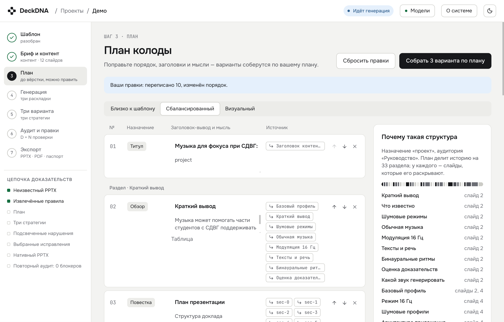
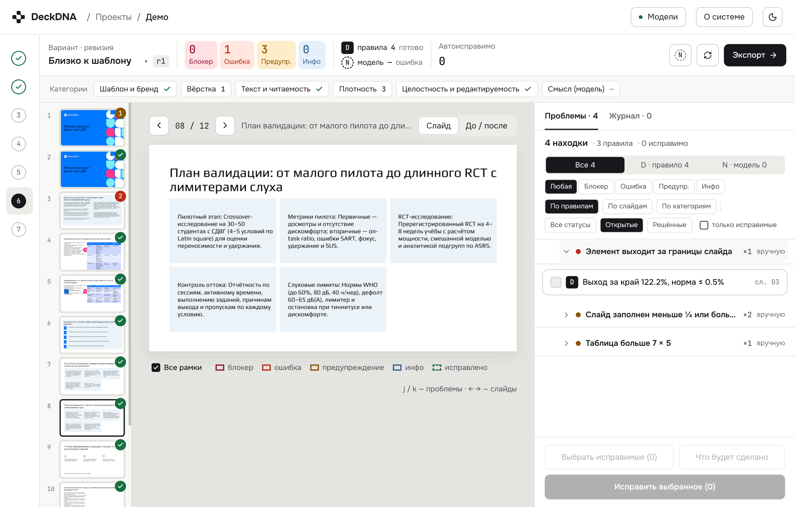
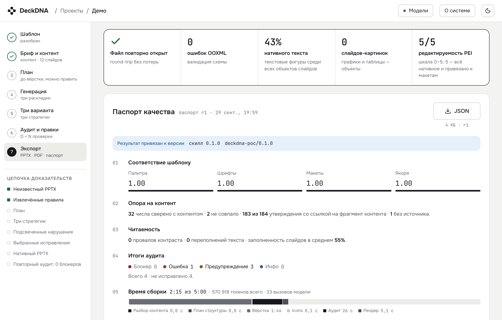
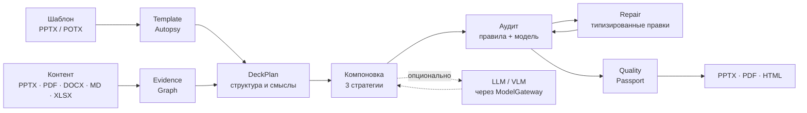
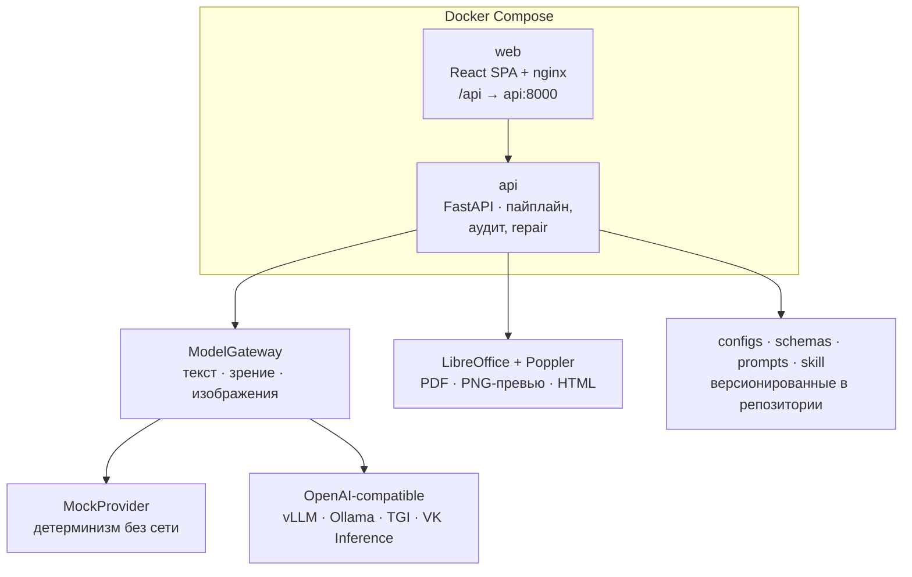

<p align="center">
  
</p>

<h1 align="center">DeckDNA — цифровой дизайнер презентаций</h1>

<p align="center">
  <a href="https://github.com/IT-AUL/case-14-ai-presentation-designer-team-19/actions/workflows/ci.yml"></a>
  <a href="https://github.com/IT-AUL/case-14-ai-presentation-designer-team-19/releases"></a>
  <a href="LICENSE"></a>
</p>

<p align="center">
  Загружаете шаблон и материалы — получаете готовую колоду в фирменном стиле,
  с прозрачным аудитом и редактируемым PowerPoint-файлом. Без ручной вёрстки.
</p>

<p align="center">
  <b>Демо-стенд: <a href="https://deckdna.it-aul.ru/">deckdna.it-aul.ru</a></b>
</p>

<p align="center">
  
</p>

---

**Содержание**

- [Возможности](#возможности)
- [Как это работает](#как-это-работает)
- [Архитектура](#архитектура)
- [Быстрый старт](#быстрый-старт)
- [API: пять запросов до готовой колоды](#api-пять-запросов-до-готовой-колоды)
- [Провайдер моделей](#провайдер-моделей)
- [CLI и skill](#cli-и-skill)
- [Стек](#стек)
- [Релизы и обновления](#релизы-и-обновления)
- [Проверки качества](#проверки-качества)
- [Требования и ограничения](#требования-и-ограничения)
- [Лицензия](#лицензия)

## Возможности

- **Дизайн-DNA из любого шаблона.** DeckDNA не полагается на заготовленные макеты: система разбирает
  загруженную презентацию, извлекает палитру, шрифты, макеты и паттерны размещения — и воспроизводит стиль.
- **Детерминизм в центре, модель — на периферии.** Сборка колоды воспроизводима без ИИ вообще:
  встроенный `MockProvider` делает всё на детерминированной логике, а языковые модели
  подключаются там, где нужны копирайтинг и суждение.
- **Три стратегии одновременно.** Один прогон даёт три варианта колоды — консервативный,
  сбалансированный и более визуальный. Выбор — за пользователем, а не за генератором.
- **Правки до вёрстки.** План колоды, правила шаблона и выбранные варианты можно поменять
  до запуска компоновки, а не потом ломать готовые слайды.
- **Проверки как код.** Аудит фиксирует ошибки OOXML, выход элементов за границы, недопустимые
  шрифты и расстояния. Автоисправления выполняются как типизированный отчёт и повторно проверяются.
- **Quality Passport.** Каждая колода отвечает на вопрос «откуда что взялось»: версии
  конфигов и промптов, хеши входных файлов, признаки использованного контента, оценки.
- **Экспорт без сюрпризов.** Нативный редактируемый PPTX, PDF через LibreOffice
  и HTML-вьюер для веба — с гарантиями round-trip.
- **API-first.** Всё, что видит UI, делается через REST: проекты, загрузки, правила,
  варианты, прогоны, аудит, экспорты и артефакты.

| План колоды | Аудит | Паспорт качества |
|:---:|:---:|:---:|
|  |  |  |
| Порядок и смыслы можно править до вёрстки | Каждое нарушение — правило, слайд и рамка | Метрики, время сборки, версии и хеши |

## Как это работает



**Шаблон → Design DNA.** `Template Autopsy` читает не только masters/layouts, но и обычные слайды,
выбирает эталоны и дистиллирует правила: палитру, шрифтовую шкалу, заполненность, выравнивание,
допустимые зоны. Контент, в свою очередь, превращается в граф опор — у каждого будущего
утверждения есть источник.

**План до вёрстки.** Система строит `DeckPlan`: цель, аудитория, разделы, мысли и типы слайдов.
План редактируется в интерфейсе до того, как потрачен прогон.

**Компоновка нативными объектами.** Слайды собираются клонированием эталонов и заполнением
слотов: заголовки, абзацы, таблицы и фигуры остаются редактируемыми объектами PowerPoint,
а не картинками.

| Стратегия | Идея |
|---|---|
| `faithful` | максимально близко к эталонам шаблона |
| `balanced` | баланс стиля, плотности и читаемости |
| `visual` | больше визуальных блоков и схем |

**Аудит → исправление → повторный аудит.** Каталог правил проверяет целостность OOXML,
геометрию, шрифты и контраст; при подключённой модели добавляются контекстные проверки.
Находки превращаются в типизированные исправления, и результат проходит аудит заново.
Полный каталог и жизненный цикл правок — в [docs/AUDIT.md](docs/AUDIT.md).

## Архитектура



Все модельные роли — за единым `ModelGateway` и интерфейсом провайдера: `MockProvider`
по умолчанию, OpenAI-совместимый endpoint или адаптер VK Inference. Роли (текст, зрение,
генерация изображений) настраиваются независимо — см. [docs/MODELS.md](docs/MODELS.md).
Более глубокое описание слоёв, файловых контрактов и схем — в [docs/ARCHITECTURE.md](docs/ARCHITECTURE.md).

## Быстрый старт

### Готовые образы из реестра (без сборки)

```bash
git clone https://github.com/IT-AUL/case-14-ai-presentation-designer-team-19.git
cd case-14-ai-presentation-designer-team-19

DECKDNA_VERSION=v1.0.0 docker compose up -d --no-build --pull always
```

Без локальной сборки работает только опубликованная версия (`v1.0.0` — первая). До её публикации
используйте запуск из исходников. Альтернатива GHCR — Docker Hub:

```bash
DECKDNA_REGISTRY=docker.io/renatgubaudullin DECKDNA_VERSION=v1.0.0 docker compose up -d --no-build --pull always
```

### Из исходников

```bash
docker compose up -d --build   # первый запуск может занять время
```

Откройте `http://localhost:8080`. API-документация — `http://localhost:8000/docs`.
Всё настраивается через корневой `.env` — шаблон в [`.env.example`](.env.example). По умолчанию
сервис детерминирован и не ходит в сеть за моделью: интерфейс, загрузка шаблона и генерация
работают на встроенной логике, а первый сбор из исходников также скачает базовые образы
и пакеты сборки. Внешние модели и деплой описаны в [docs/ARCHITECTURE.md](docs/ARCHITECTURE.md).

Проверка после старта:

```bash
curl http://localhost:8000/healthz
curl http://localhost:8080/healthz
```

## API: пять запросов до готовой колоды

```text
POST /api/v1/projects                                 → создать проект
POST /api/v1/projects/{id}/uploads                    → загрузить шаблон PPTX/POTX
POST /api/v1/projects/{id}/uploads                    → загрузить контентные материалы
POST /api/v1/projects/{id}/generations                → запустить генерацию
GET  /api/v1/exports/{exportId}/download              → забрать PPTX/PDF/HTML
```

Полный curl-пример с опросом статуса и списком всех маршрутов — в
[docs/contracts/API.md](docs/contracts/API.md). Схемы и типы — в
[`docs/contracts/openapi.json`](docs/contracts/openapi.json) и `/docs` запущенного сервиса.

## Провайдер моделей

`MockProvider` по умолчанию: полный пайплайн работает без сети и ключей, повторный прогон
детерминирован — удобно для тестов, CI и воспроизводимости. Модели подключаются через
OpenAI-совместимый endpoint (`MODEL_BASE_URL`, `MODEL_API_KEY`, `MODEL_NAME`) или
`MODEL_PROVIDER_TYPE=vk_inference` для VK Inference; отдельные роли для текста,
зрения и изображений — через переменные `MODEL_TEXT_*`, `MODEL_VISION_*`, `MODEL_IMAGE_*`.
Подробности и рекомендуемые модели — в [docs/MODELS.md](docs/MODELS.md).

## CLI и skill

`skill/` — переносимый Python-интерфейс к тому же пайплайну, пригодный для разового запуска
и интеграции. Пример на встроенной фикстуре:

```bash
python skill/run_skill.py \
  --template backend/tests/fixtures/template_samples/synthetic_unseen.pptx \
  --materials backend/tests/fixtures/content_text_pack \
  --output-dir out/
```

Документация интерфейса — в [skill/SKILL.md](skill/SKILL.md).

## Стек

| Слой | Технологии |
|---|---|
| Фронтенд | React, TypeScript, Vite, nginx (SPA + прокси `/api`) |
| Бэкенд | Python 3.12, FastAPI, Uvicorn, Pydantic-контракты |
| Документы | OOXML (PPTX/POTX), LibreOffice, Poppler (`pdftoppm`) |
| Модели | `ModelGateway`: Mock / OpenAI-compatible / VK Inference — text+vision `qwen-3.8-27b`, image `black-forest-labs/flux.2-klein-4b` |
| Качество | каталог детерминированных правил, contextual VLM-аудит, типизированный repair |
| Поставка | Docker Compose, GitHub Actions, multi-arch образы (amd64/arm64) → GHCR + Docker Hub |

## Релизы и обновления

CI прогоняет проверки фронта и бэка, сборку, статический и runtime smoke-тест Compose.
Тег вида `vX.Y.Z` на коммите из `main` дополнительно собирает и публикует multi-arch образы
в два реестра и создаёт GitHub Release.

**Имена образов и версии.** Версия образа всегда равна git-тегу релиза — список доступных
версий смотрите на странице [Releases](https://github.com/IT-AUL/case-14-ai-presentation-designer-team-19/releases)
(в описании каждого релиза уже лежит готовая команда запуска). Например, для тега `v1.0.0`:

| Реестр | web | api |
|---|---|---|
| GHCR | `ghcr.io/it-aul/deckdna-web:v1.0.0` | `ghcr.io/it-aul/deckdna-api:v1.0.0` |
| Docker Hub | `docker.io/renatgubaudullin/deckdna-web:v1.0.0` | `docker.io/renatgubaudullin/deckdna-api:v1.0.0` |

Compose сам подставляет их по двум переменным: `DECKDNA_VERSION` — тег, `DECKDNA_REGISTRY` —
реестр (`ghcr.io/it-aul` по умолчанию, `docker.io/renatgubaudullin` для Docker Hub).
Команда обновления локального стека до конкретной версии — та же, что для запуска:
`DECKDNA_VERSION=vX.Y.Z docker compose up -d --no-build --pull always`.
Для self-hosted и процедуры публикации образов — [docs/ARCHITECTURE.md](docs/ARCHITECTURE.md).

## Проверки качества

```bash
cd backend && python -m pytest -q             # юнит и интеграционные тесты
cd frontend && npm test -- --run              # тесты фронтенда
docker compose up -d --build                  # поднять стек
```

CI повторяет этот же путь, а workflow сопровождается `actionlint`.

## Требования и ограничения

Что важно знать перед эксплуатацией — без преувеличений:

- Узлы и пайплайн спроектированы одиночным контейнером: состояние проектов держится в памяти
  API и очищается при перезапуске. Для демо и self-hosted сценария этого достаточно;
  персистентное хранилище — намеренно выведено за границу MVP.
- Аутентификации и изоляции пользователей нет — сервис рассчитан на доверенный контур.
  В Compose порты привязаны к loopback; для внешнего доступа поставьте TLS-proxy с авторизацией.
- Контекстные проверки моделью включаются только при настроенном провайдере.
- Нативный SmartArt пока заменён группами редактируемых фигур — задача на развитие.
- HTML-экспорт — это веб-вьюер колоды, а не интерактивный редактор.

Полный список жёстких ограничений и оговорок — в [docs/AUDIT.md](docs/AUDIT.md).

## Лицензия

Apache-2.0 — см. [LICENSE](LICENSE).
